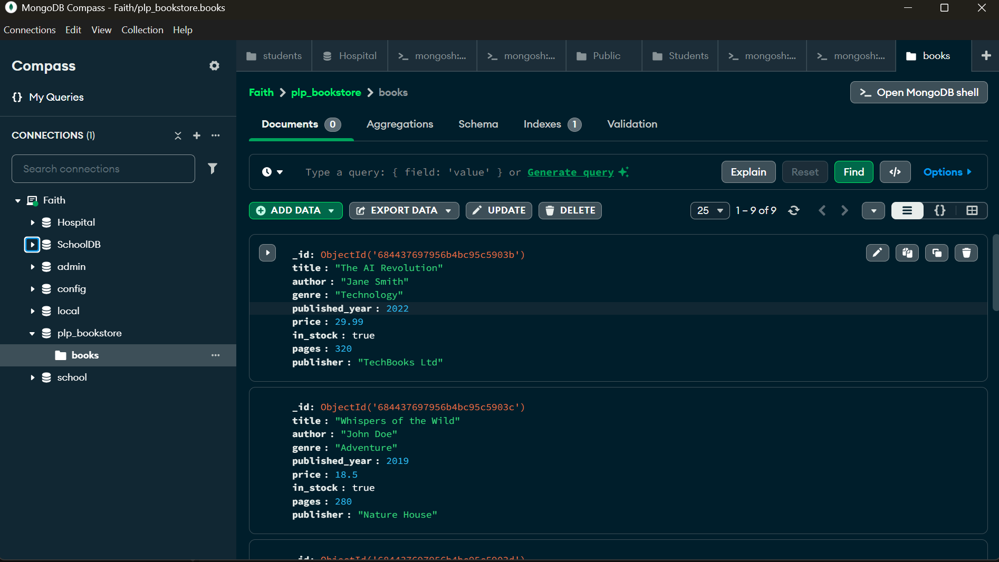

# 📚 MongoDB Week 1 Assignment – PLP Bookstore

## 🚀 Objective
Demonstrate knowledge of MongoDB fundamentals: CRUD operations, advanced queries, aggregation, indexing, and performance analysis.

---
## 📸 Screenshot

Here is a screenshot of my MongoDB Compass showing the `plp_bookstore` and `books` collection:



## 🛠️ Setup Instructions

### Option 1: Local MongoDB Setup
1. Install MongoDB Community Edition: https://www.mongodb.com/try/download/community
2. Open terminal and run:
   ```bash
   mongosh